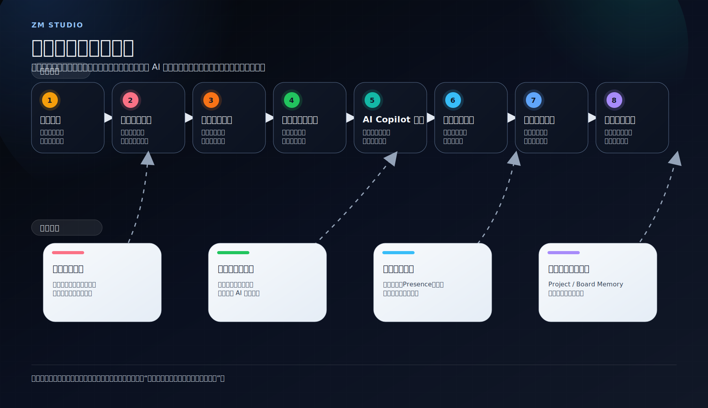
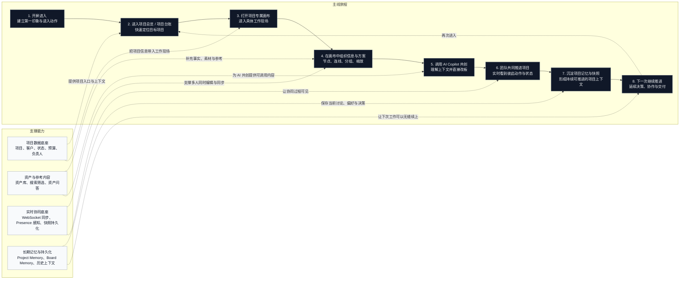

# User Core Experience Flow

这是一张 `汇报展示版` 的用户核心体验流程图，采用 `主线旅程 + 支撑能力` 的表达方式。

## Flowchart

## One-Line Story

用户从项目入口进入，在空间化画布里组织项目，与 AI 和团队一起推进决策，过程中不断调用已有数据，并把结果沉淀成可持续的项目知识。

## Presenter Notes

- 第一段先讲主线：用户不是在不同工具之间跳转，而是在一个连续空间里推进同一个项目。
- 第二段再讲支撑能力：项目数据、资产数据、实时协同、长期记忆共同托住这条主线。
- 第三段收束价值：这个产品的核心不是单点 AI，也不是单点白板，而是 `项目上下文持续积累的协同工作空间`。
