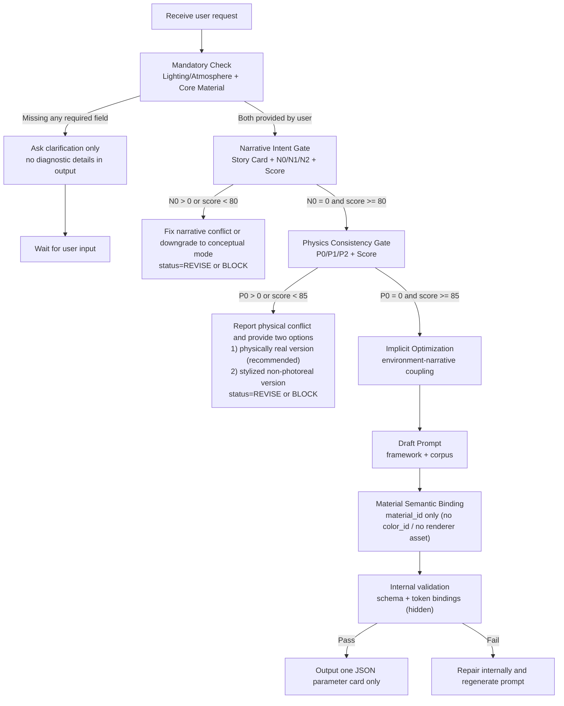

# Architectural Prompting Skill

This repository contains a production-oriented skill package for generating
architectural rendering prompts with both narrative coherence and physical
plausibility.

## Goal

Generate prompts that are:

- visually strong,
- physically consistent,
- and story-driven (not just keyword stacking).

## Core System

The prompt pipeline is built around two mandatory gates before final drafting:

1. Narrative Gate
- Build a Story Card: `Where / When / Who / What / Why / Mood / Evidence`.
- Detect narrative conflicts with `N0/N1/N2`.
- Compute `Narrative Score`.
- Block photorealistic storytelling claims if `N0 > 0`.

2. Physics Gate
- Check lighting, weather, materials, optics, structure, and behavior
  consistency.
- Detect physical conflicts with `P0/P1/P2`.
- Compute `Physics Score`.
- Block photorealistic claims if `P0 > 0`.

## Workflow Diagram

## Output Policy

Default user-facing mode is **JSON_PARAM_CARD_ONLY**:

- Show one JSON parameter card with 8 fixed segments.
- Wrap the final JSON in a fenced `json` code block for one-click copy.
- Do not show gate scores, validation logs, status fields, or token binding details.
- If required inputs are missing, return a JSON clarification object only.
- `输出控制` must include `构图锁定`, explicitly stating original composition lock
  (no camera angle / viewpoint / perspective change).

Internal checks still run:

- Narrative and physics gates are still enforced.
- Material semantic binding is still enforced (`material_id`), but color IDs and renderer bindings are disabled by default.
- Internal structured validation can still use
  `resources/schemas/apr-output.schema.json`.

Optional **JSON_DEBUG** mode:

- Only return full JSON when the user explicitly asks for JSON or API-structured output.

## Repository Layout

- `SKILL.md`: Main skill definition and execution requirements.
- `resources/framework.md`: Prompt framework template (`v1.5`).
- `resources/workflow.md`: End-to-end workflow (`v5.1`).
- `resources/corpus.md`: Lighting/material terminology corpus.
- `resources/categories.csv`: Quick category presets.
- `resources/integration_map.md`: Template-to-corpus mapping.
- `resources/narrative_rules.md`: Narrative rule engine and scoring.
- `resources/physics_rules.md`: Physics rule engine and scoring.
- `resources/narrative_regression_cases.md`: Narrative regression suite.
- `resources/physics_regression_cases.md`: Physics regression suite.
- `resources/catalogs/material_catalog.v1.json`: Canonical material token IDs.
- `resources/schemas/apr-output.schema.json`: JSON output validation schema.
- `resources/examples/apr-output.ask-user.example.json`: ASK_USER status JSON example.
- `resources/examples/apr-output.ready.example.json`: READY status JSON example.

## Verification Strategy

Use both regression files for quality checks:

- Narrative regression validates story coherence and single-event focus.
- Physics regression validates real-world consistency constraints.

A prompt should only be treated as fully compliant when both gates pass.
